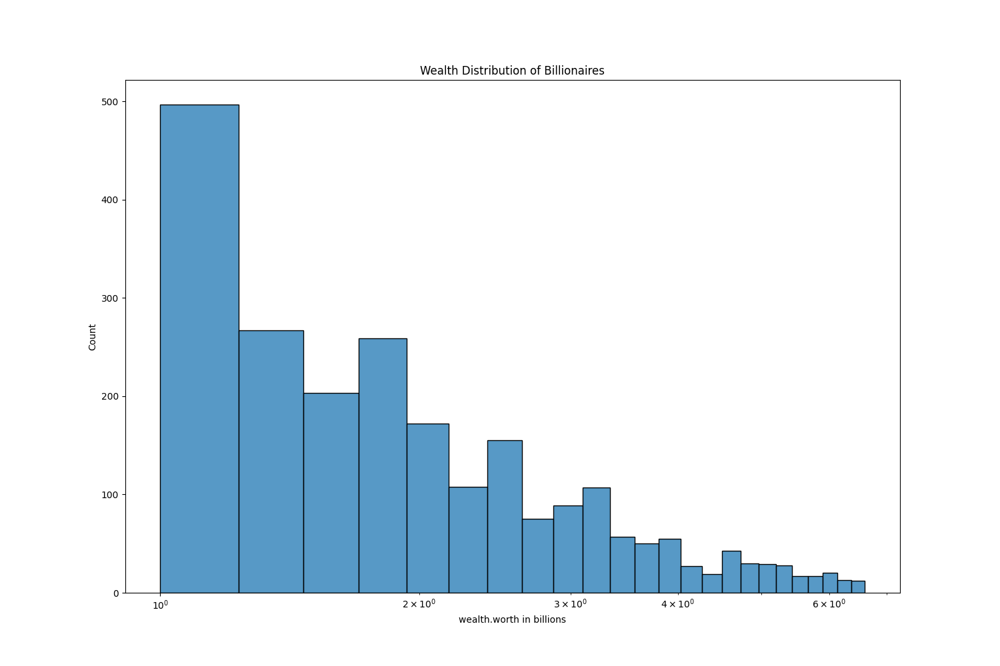
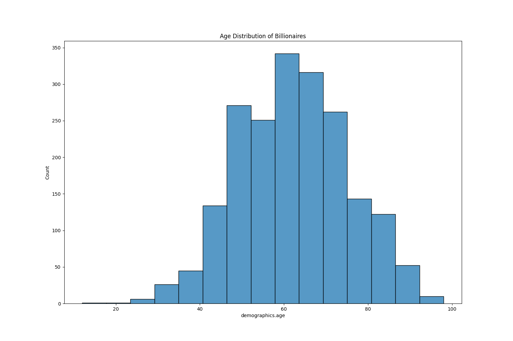
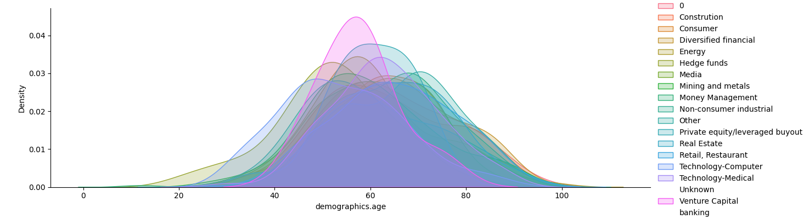
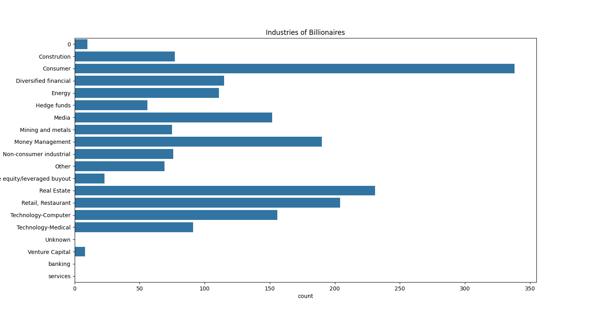
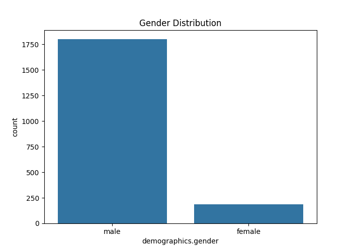
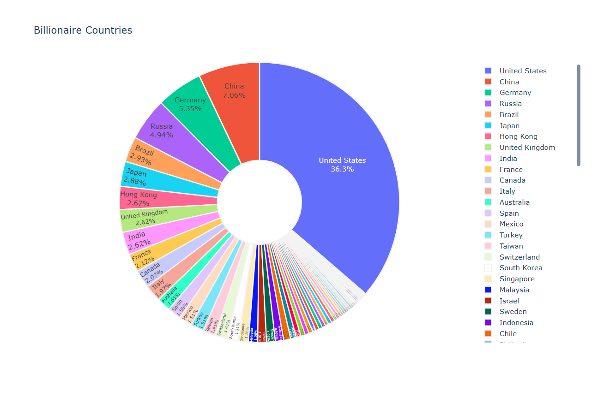

# Billionaire Dataset Exploration

This project performs an exploratory data analysis (EDA) on a dataset of billionaires, analyzing their wealth, age, industry, gender distribution, and geographical spread. Various visualizations are generated to present key insights.

## Dataset
- The dataset contains details about billionaires, including their net worth, industry, country, and demographics.
- Data is cleaned, missing values are handled, and outliers are removed.

## Requirements
To run this project, install the required dependencies:
```bash
pip install pandas matplotlib seaborn plotly selenium webdriver-manager
```

## Analysis and Visualizations

### 1. Wealth Distribution
This plot visualizes the distribution of billionaire net worths. A log scale is used for better readability.


### 2. Age Distribution
The histogram shows the age distribution of billionaires.


### 3. Age Distribution by Industry
Kernel Density Estimation (KDE) plots show the distribution of billionaire ages across industries.


### 4. Industries of Billionaires
A bar chart visualizing the number of billionaires in each industry.


### 5. Gender Distribution
A simple count plot showing the gender distribution among billionaires.


### 6. Billionaires by Country
A pie chart visualizing the distribution of billionaires across different countries.


## How to Run the Script
1. Place the dataset `billionaires.csv` in the `EDA` directory.
2. Run the Python script:
   ```bash
   python Exploration_Data_Analysis_Project.py
   ```
3. The figures will be saved in the `figures` folder.

## Notes
- The script is fully automated and generates visualizations after processing the data.
- It uses Selenium to capture the Plotly visualization as a static image.
- Ensure ChromeDriver is installed and compatible with your browser version.

## Author
Your Name

---
✅ All figures will be saved inside the `figures` folder after execution.

